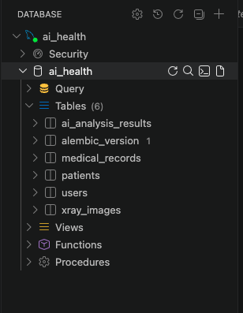

# 3일차 데이터베이스 마이그레이션

## 1. 작업 개요

ERD를 기준으로 SQLAlchemy ORM 모델을 작성하고, Alembic을 이용하여 MySQL 데이터베이스에 스키마를 적용하였다.

---

## 2. 사용 기술

- FastAPI
- SQLAlchemy ORM
- Alembic
- MySQL 8.0
- Docker Compose
- asyncmy

---

## 3. 작성한 데이터베이스 모델

다음 5개의 모델을 작성하였다.

- `users`
- `patients`
- `medical_records`
- `xray_images`
- `ai_analysis_results`

각 모델은 `app/models/` 아래의 Python 파일로 분리하여 작성하였다.

```text
app/models/
├── enums.py
├── user.py
├── patient.py
├── medical_record.py
├── xray_image.py
└── ai_analysis_result.py
```

---

## 4. 테이블 관계

테이블 관계는 다음과 같다.

```text
patients
  ↓
medical_records
  ├── xray_images
  └── ai_analysis_results

users
  ↓
xray_images
```

- 한 명의 환자는 여러 개의 진료 기록을 가질 수 있다.
- 하나의 진료 기록에는 여러 개의 X-Ray 이미지가 연결될 수 있다.
- 하나의 진료 기록에는 여러 개의 AI 분석 결과가 연결될 수 있다.
- X-Ray 이미지는 업로드한 사용자와 연결된다.

---

## 5. Docker 환경 실행

FastAPI 서버와 MySQL 데이터베이스를 Docker Compose로 실행하였다.

```bash
docker compose up --build -d
```

실행 상태는 다음 명령어로 확인하였다.

```bash
docker compose ps
```

FastAPI와 MySQL이 모두 `healthy` 상태인 것을 확인하였다.

---

## 6. Alembic 마이그레이션 파일 생성

SQLAlchemy 모델을 기준으로 Alembic 마이그레이션 파일을 자동 생성하였다.

```bash
docker compose exec fastapi alembic revision --autogenerate -m "create initial tables"
```

Alembic이 다음 5개 테이블의 추가를 감지하였다.

```text
patients
users
medical_records
ai_analysis_results
xray_images
```

생성된 마이그레이션 파일은 다음과 같다.

```text
alembic/versions/326253dcf4c6_create_initial_tables.py
```

---

## 7. 데이터베이스에 마이그레이션 적용

다음 명령어를 사용하여 최신 마이그레이션을 MySQL에 적용하였다.

```bash
docker compose exec fastapi alembic upgrade head
```

다음 결과를 통해 마이그레이션이 정상적으로 적용된 것을 확인하였다.

```text
Running upgrade -> 326253dcf4c6, create initial tables
```

---

## 8. 생성된 테이블 확인

다음 명령어로 MySQL 데이터베이스에 생성된 테이블을 확인하였다.

```bash
docker compose exec mysql mysql -uhealth_user -ppassword1234 -D ai_health -e "SHOW TABLES;"
```

확인된 테이블은 다음과 같다.

```text
ai_analysis_results
alembic_version
medical_records
patients
users
xray_images
```

`alembic_version`은 Alembic이 현재 적용된 마이그레이션 버전을 관리하기 위해 자동으로 생성한 테이블이다.

---

## 9. DB Viewer 확인

DB Viewer를 이용하여 `ai_health` 데이터베이스에 테이블이 정상적으로 생성된 것을 확인하였다.

아래에 DB Viewer 확인 화면을 첨부한다.

```text

```

---

## 10. 전체 결과

ERD를 기준으로 SQLAlchemy ORM 모델을 작성하고, Alembic 마이그레이션 파일을 생성하였다.

생성된 마이그레이션을 MySQL 데이터베이스에 적용하여 다음 5개의 테이블을 생성하였다.

```text
users
patients
medical_records
xray_images
ai_analysis_results
```

FastAPI와 MySQL은 Docker Compose 환경에서 정상적으로 실행되었으며, 마이그레이션 적용 후 테이블 생성까지 확인하였다.